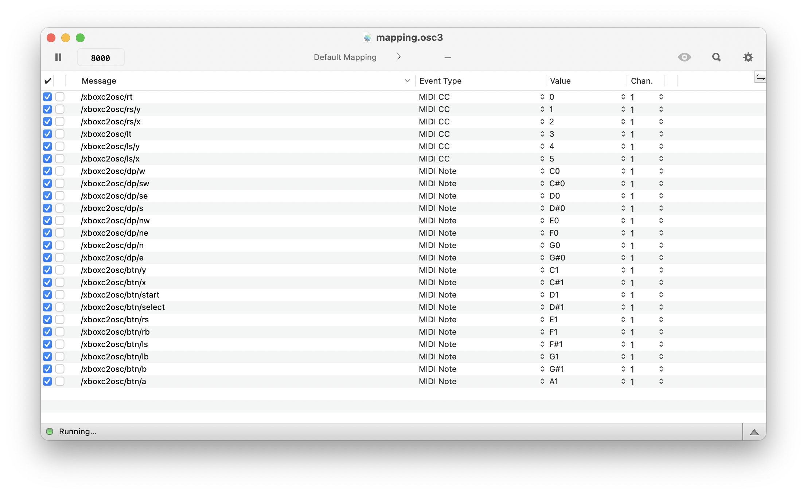

# `xbox2osc`

When you run this application in the terminal, it will attempt to locate an Xbox Controller connected to your system via HID. If found, input from the controller will be redirected to OSC (see below),

Run `/xboxc2osc -h` to see available settings:

```
Usage of ./xboxc2osc:
  -host string
    	Osc reciever host (default "127.0.0.1")
  -port int
    	Osc reciever port (default 8000)
  -prefix string
    	Osc path prefix (default "xboxc2osc")
```

## Osculator

If you want to use [Osculator](https://osculator.net/) to route the OSC messages to MIDI, there is an [example configuration file included](mapping.osc3)




## OSC routes

By default the osc routes are prefixed with `/xboxc2osc`, you can change this by setting the `-prefix` flag.

Currently the routes will return two data types:

 - _(bool)_ is a basic `true` / `false` boolean value
 - _(float)_ a normalized float value between `0.0` and `1.0`

### Buttons

Button values are sent as a `true` when a press is detected, and reset to `false` after press.

 - `/xboxc2osc/btn/a` _(bool)_
 - `/xboxc2osc/btn/b` _(bool)_
 - `/xboxc2osc/btn/x` _(bool)_
 - `/xboxc2osc/btn/y` _(bool)_
 - `/xboxc2osc/btn/lb` _(bool)_ left trigger
 - `/xboxc2osc/btn/rb` _(bool)_ right trigger
 - `/xboxc2osc/btn/ls` _(bool)_ left joystick button
 - `/xboxc2osc/btn/rs` _(bool)_ right joystick button
 - `/xboxc2osc/btn/select` _(bool)_
 - `/xboxc2osc/btn/start` _(bool)_


### Direction Pad

Input to the DPad is treated like button presses, sending `true` and then `false`. The route name depends on the compass direction (NW = Northwest, so the top left of the Dpad).

- `/xboxc2osc/btn/n` _(bool)_
- `/xboxc2osc/btn/ne` _(bool)_
- `/xboxc2osc/btn/e` _(bool)_
- `/xboxc2osc/btn/se` _(bool)_
- `/xboxc2osc/btn/s` _(bool)_
- `/xboxc2osc/btn/sw` _(bool)_
- `/xboxc2osc/btn/w` _(bool)_
- `/xboxc2osc/btn/nw` _(bool)_

### Joysticks

- `/xboxc2osc/ls/x` _(float)_
- `/xboxc2osc/ls/y` _(float)_
- `/xboxc2osc/rs/x` _(float)_
- `/xboxc2osc/rs/y` _(float)_

#### Triggers


- `/xboxc2osc/lt` _(float)_
- `/xboxc2osc/rt` _(float)_

